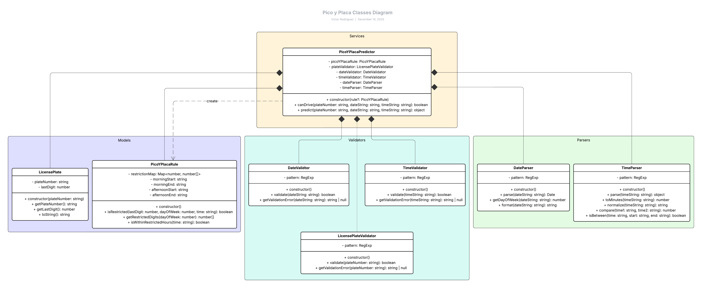

# Pico y Placa Predictor

A command-line application that predicts whether a vehicle can be on the road based on Quito-Ecuador's "Pico y Placa" restrictions.

## About

This project implements a predictor for Quito's vehicle circulation restrictions. The system determines if a vehicle with a specific license plate number can circulate on a given date and time, following the official "Pico y Placa" regulations.

## Problem statement

The "Pico y Placa" is a traffic regulation in Quito that restricts vehicle circulation based on the last digit of the license plate number, the day of the week, and specific time windows during the day.

The application will:
- Accept a license plate number (e.g., PBX-1234)
- Accept a date in **DD/MM/YYYY** or **DD-MM-YYYY** format (e.g., 15/03/2024 or 15-03-2024)
- Accept a time in **HH:MM** 24-hour format (e.g., 08:30, 17:00)
- Return whether the vehicle can be on the road or not

### Input format requirements

- **Date**: DD/MM/YYYY or DD-MM-YYYY (e.g., "15/03/2024", "15-03-2024")
- **Time**: HH:MM in 24-hour format (e.g., "08:30", "17:00")
- **License Plate**: Ecuadorian format with 3 letters, hyphen, and 4 digits (e.g., "PBX-1234")

## Technologies

- **JavaScript (ES6+)**: Core programming language
- **Node.js**: Runtime environment for script execution
- **Jest**: Testing framework for unit and integration tests
- **Git**: Version control system

### Why Node.js?

This project is written in pure JavaScript and runs as a console application using **Node.js**, that is required to execute the JavaScript files outside of a browser environment.

Node.js provides:
- JavaScript runtime for command-line execution
- Access to file system and console I/O
- Module system for organizing code
- NPM for managing development dependencies (like Jest)

## Project Structure

```
pico-y-placa-predictor/
├── docs/                           # Documentation
│   ├── analysis-planning.md        # Use cases and requirements analysis
│   └── design.md                   # Architecture and design decisions
├── src/                            # Source code
│   ├── models/                     # Domain models
│   ├── validators/                 # Input validators
│   ├── parsers/                    # Data parsers
│   ├── services/                   # Business logic
│   ├── cli/                        # Command-line interface
│   └── index.js                    # Entry point
├── tests/                          # Test files
│   ├── unit/                       # Unit tests
│   └── integration/                # Integration tests
├── package.json                    # Project configuration
└── README.md                       # This file
```

## Installation

1. Clone the repository:
```bash
git clone https://github.com/Vikus7/pico-y-placa-predictor.git
cd pico-y-placa-predictor
```

2. Install dependencies (for testing):
```bash
npm install
```

## Usage

### Quick start

Run the application using any of these commands:

```bash
npm start                    # Recommended
node pico.js                 # Alternative
node src/index.js           # Direct execution
```

### Interactive mode

Run without arguments to enter interactive mode:

```bash
npm start
```

The application will prompt you for:
1. License plate number
2. Date (DD/MM/YYYY or DD-MM-YYYY)
3. Time (HH:MM in 24-hour format)

### Command line mode

Provide all arguments at once:

```bash
npm start -- <plate> <date> <time>
# or
node pico.js <plate> <date> <time>
```

**Examples:**
```bash
npm start -- ABC-1234 15/03/2024 08:30
node pico.js PBX-5678 20-03-2024 17:00
node src/index.js XYZ-9990 22/03/2024 07:15
```

### Help

Display usage information:

```bash
npm start -- --help
node pico.js --help
```

## Pico y Placa rules
The application implements Quito's traffic restrictions:

| Day       | Restricted last digits | Restricted hours       |
|-----------|------------------------|------------------------|
| Monday    | 1, 2                   | 07:00-09:30, 16:00-19:30 |
| Tuesday   | 3, 4                   | 07:00-09:30, 16:00-19:30 |
| Wednesday | 5, 6                   | 07:00-09:30, 16:00-19:30 |
| Thursday  | 7, 8                   | 07:00-09:30, 16:00-19:30 |
| Friday    | 9, 0                   | 07:00-09:30, 16:00-19:30 |
| Weekend   | No restrictions        | -                      |

## Testing

Run all tests:
```bash
npm test
```

Run tests in watch mode:
```bash
npm run test:watch
```

Generate coverage report:
```bash
npm run test:coverage
```

**Test suite:**
- 205+ tests
- Unit tests for all components
- Integration/E2E tests
- 100% coverage of business logic

## Documentation

### Analysis & Planning
See [analysis-planning.md](docs/analysis-planning.md) for problem analysis, use cases, and requirements.

### Design

The system uses an object-oriented architecture with clear separation of concerns. Each component has a single responsibility:

- **Models**: Represent domain concepts (LicensePlate, PicoYPlacaRule)
- **Validators**: Verify input format and correctness
- **Parsers**: Transform strings into usable data structures
- **Services**: Orchestrate components and apply business logic
- **CLI**: Handle user interaction

**Class Diagram:**



For detailed architecture explanation and design decisions, see [design.md](docs/design.md).

## Development approach

This project follows:
- Object-Oriented Programming (OOP) paradigm
- Conventional Commits standard
- Separation of concerns architecture

## Project Status

**Version 1.0 - Complete**

### Features
-  License plate validation (Ecuadorian format)
-  Date and time validation
-  Pico y Placa rule implementation
-  Command-line interface (interactive & argument mode)
-  Comprehensive test suite (205+ tests)
-  Detailed error messages
-  User-friendly output

---

*Last updated: December 2025*
